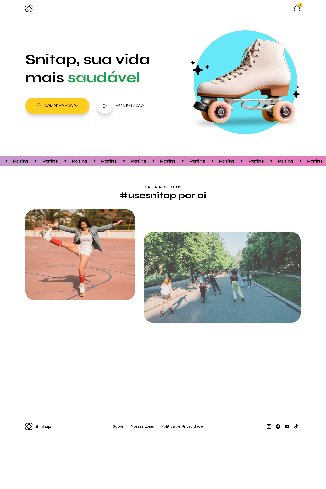

# 🛼 Snitap Patins — Landing Page

> Landing page de uma marca fictícia de patins, desenvolvida para praticar transitions, animations e responsividade com Media Queries.


---

## 📋 Sobre o Projeto

A **Snitap Patins** é uma landing page de uma marca fictícia de patins com o slogan *"sua vida mais radical, divertida e saudável"*. A página conta com uma hero section impactante, um banner deslizante em loop contínuo, galeria de fotos com hashtag da marca e rodapé com redes sociais. O projeto foi desenvolvido com foco em **transitions**, **animations CSS** e **responsividade para mobile**.

---

## ✨ Funcionalidades

- ✅ Navbar com logo e ícone de carrinho
- ✅ Hero section com imagem do produto, estrelas decorativas e CTAs
- ✅ **Banner deslizante em loop** com animação contínua
- ✅ Galeria de fotos **#usesnitap** com cards e perfil do usuário
- ✅ Efeitos de **hover** com transitions suaves nos botões e cards
- ✅ Rodapé com links e ícones de redes sociais
- ✅ Layout **responsivo para mobile** com Media Queries

---

## 🖼️ Preview



---

## 🛠️ Tecnologias Utilizadas

| Tecnologia | Finalidade |
|------------|------------|
| HTML5 | Estrutura semântica da landing page |
| CSS3 | Estilização, animações, transitions e responsividade |

---

## 🧠 Foco Técnico — Transitions & Animations

Este projeto foi pensado como laboratório de animações e transições CSS. Alguns conceitos aplicados:

- `transition` para suavizar efeitos de hover em botões, cards e links
- `@keyframes` para criar animações personalizadas e reutilizáveis
- `animation` com `infinite` para o banner deslizante em loop contínuo
- `animation-timing-function` para controlar a aceleração das animações
- `transform` combinado com `transition` para efeitos de escala e deslocamento
- `@media queries` para adaptar o layout completo à versão mobile

---

## 📁 Estrutura de Pastas

```
📦 lp-patins-rockseat
├── 📄 index.html
├── 📁 styles/
│   └── style.css
└── 📁 assets/
    ├── banner.svg
    ├── 📁 hero/
    │   ├── patins-image.png
    │   ├── Ellipse.svg
    │   ├── Stars-1.svg
    │   └── Stars-2.svg
    ├── 📁 images/
    │   ├── 01.svg
    │   ├── 02.svg
    │   ├── 03.svg
    │   ├── 04.svg
    │   └── person.png
    └── 📁 icons/
        ├── logo.svg
        ├── shopping-bag-01.svg
        ├── play.svg
        ├── instagram.svg
        ├── facebook.svg
        ├── youtube.svg
        └── tiktok.svg
```

---

## 🚀 Como Visualizar o Projeto

1. Clone o repositório:
```bash
git clone https://github.com/WallissonDev/lp-patins-rockseat.git
```

2. Acesse a pasta do projeto:
```bash
cd lp-patins-rockseat
```

3. Abra o arquivo `index.html` no navegador.

> Ou acesse diretamente pelo **[GitHub Pages →](https://wallissondev.github.io/lp-patins-rockseat/)**

---

## 📚 Aprendizados

- Criação de **animações CSS** com `@keyframes` e `animation`
- Uso de **transitions** para interações suaves de hover
- Implementação de **banner infinito** com `animation: infinite`
- Combinação de `transform` com `transition` para efeitos visuais
- Adaptação do layout para **mobile** com Media Queries

---

## 👤 Autor

**Wallisson Moreira de Lima**

[](https://github.com/WallissonDev)

---

*Feito com 💙 e muito CSS animado.*
